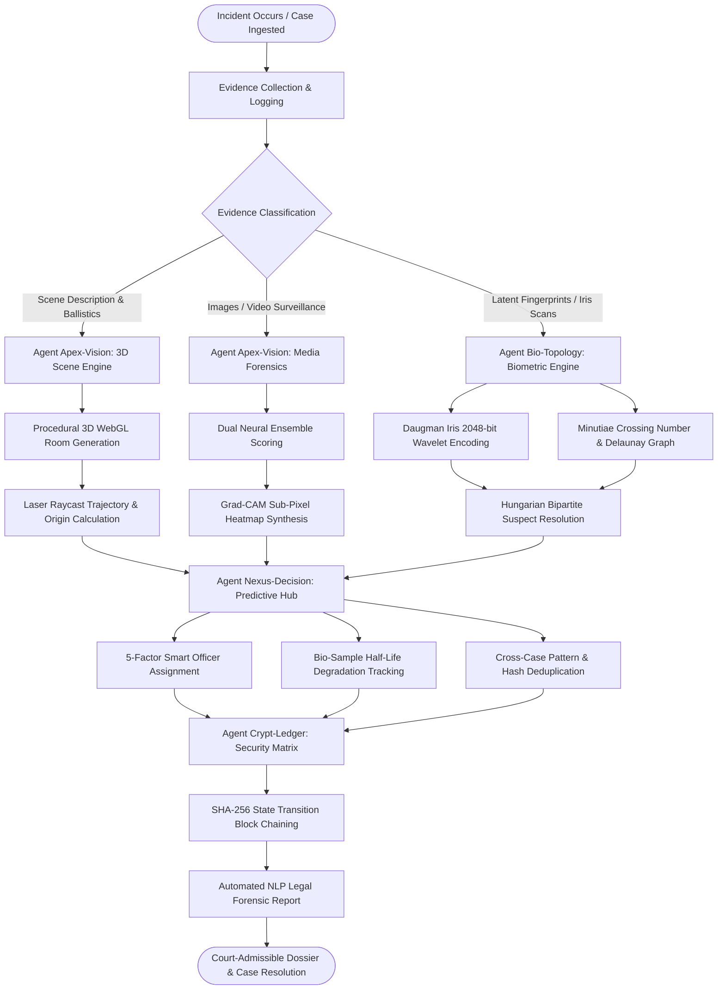
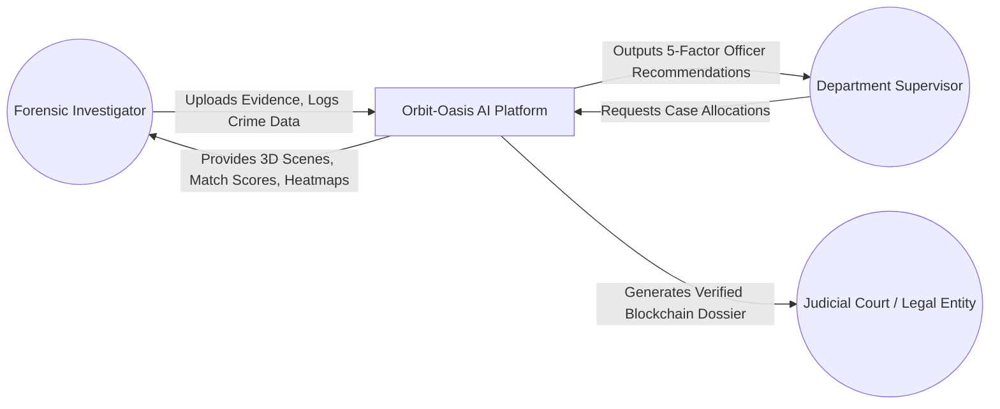
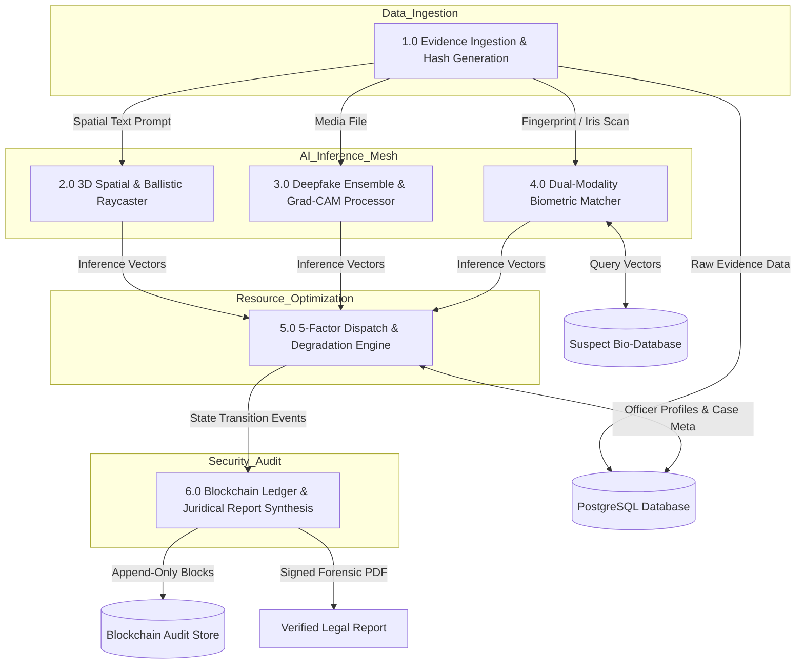
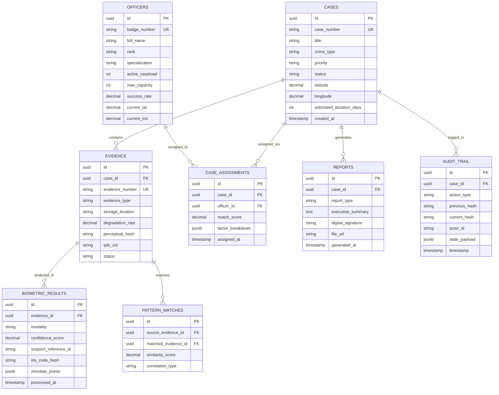

# 🏛️ PROJECT SYNOPSIS & TECHNICAL REPORT: ORBIT-OASIS
## *Enterprise AI-Powered Forensic Investigation, Biometric Mesh & Tamper-Proof Chain-of-Custody Platform*

---

## 1. Objective and Scope of the Project

### 1.1 Project Objective
The primary objective of **Orbit-Oasis** is to design and develop an end-to-end, multi-agent AI forensic intelligence ecosystem that automates, accelerates, and mathematically safeguards criminal investigation workflows. The system addresses critical systemic bottlenecks in modern law enforcement, including:
- **Massive Case Backlogs**: Transforming months of manual evidence cross-referencing into sub-second AI inferences.
- **Evidence Contamination & Chain-of-Custody Tampering**: Providing cryptographic, immutable blockchain audit trails with SHA-256 block hashing.
- **Investigator Burnout & Misallocation**: Utilizing a 5-factor multi-objective matching engine to assign cases based on officer specialization, distance, workload capacity, and historical success rates.
- **Synthetic Media & Biometric Forgery**: Employing dual-model neural ensembles with Grad-CAM sub-pixel heatmaps and multi-modal biometric fusion (Iris + Fingerprints) to prevent wrongful convictions.

### 1.2 Project Scope
The scope of Orbit-Oasis encompasses full-lifecycle forensic investigation management, spanning from crime scene inception to courtroom evidence presentation:
1. **Volumetric 3D Crime Scene Reconstruction**: Natural Language Processing (NLP) prompt-to-3D procedural room generation with inverse raycasting laser trajectory solvers for ballistic analysis.
2. **Media Forensics & Deepfake Detection**: Dual-backbone neural network classification with temporal frame-by-frame fake ratio scoring and frequency-domain artifact localization.
3. **Multi-Modal Biometrics**: 2048-bit Daugman Gabor wavelet iris demodulation and non-Euclidean fingerprint minutiae graph topology matching via Hungarian bipartite alignment.
4. **Predictive Analytics & Evidence Preservation**: Arrhenius bio-sample degradation curve simulation (DNA/blood half-life) and perceptual hash cross-case deduplication.
5. **Cryptographic Chain of Custody & Court-Admissible Reporting**: Immutable state-transition ledger with automated Juridical NLP report synthesis.

### 1.3 End-User Benefits & Real-World Impact
- **Forensic Investigators & Detectives**: Gain real-time AI assistance, rapid suspect identification in under 50ms, and interactive 3D spatial reconstructions of complex crime scenes.
- **Department Chiefs & Allocators**: Obtain data-driven, balanced caseload allocations preventing investigator burnout and ensuring equitable resource utilization.
- **Judicial Courts & Legal Prosecutors**: Receive tamper-evident, mathematically verifiable digital evidence chains accompanied by explainable AI visual artifacts (Grad-CAM heatmaps, minutiae vectors) that withstand rigorous cross-examination.
- **General Public & Citizens**: Faster resolution of criminal proceedings, protection against synthetic identity fraud, and elimination of wrongful accusations.

---

## 2. Methodology & System Architecture

### 2.1 Project Summary
Orbit-Oasis utilizes a distributed, multi-agent architecture coordinated by four specialized neural engines:
- **`Agent Apex-Vision`**: Governs spatial WebGL 3D scene generation and media forgery detection.
- **`Agent Bio-Topology`**: Manages topological graph minutiae extraction and polar iris wavelet transformations.
- **`Agent Nexus-Decision`**: Computes 5-factor officer workload dispatch, case resolution velocity, and biochemical degradation decay.
- **`Agent Crypt-Ledger`**: Validates Merkle tree hashes, immutability logging, and multi-signature case sign-offs.

---

### 2.2 System Flowchart (High-Level Process Flow)

---

### 2.3 Data Flow Diagram (DFD)

#### Level 0 DFD (Context Diagram)

#### Level 1 DFD (Decomposed Functional Pipeline)

---

### 2.4 Entity-Relationship Diagram (ERD)

---

## 3. Hardware & Software Requirements

### 3.1 Hardware Requirements

#### A. Client / Investigator Workstation
- **Processor**: Intel Core i5 / AMD Ryzen 5 (6 cores or above)
- **Memory (RAM)**: Minimum 8 GB (16 GB Recommended for 3D WebGL rendering)
- **Graphics (GPU)**: Integrated GPU with WebGL 2.0 support (Dedicated NVIDIA GTX 1650 or higher recommended for 3D spatial inspection)
- **Storage**: 256 GB SSD (Minimum 5 GB free disk space for browser caching)
- **Network**: Standard Broadband (Minimum 10 Mbps for real-time telemetry and video stream inspection)

#### B. Server & AI Inference Host
- **Compute (CPU)**: Intel Xeon or AMD EPYC (8+ vCPUs, 2.8 GHz+)
- **Memory (RAM)**: Minimum 32 GB DDR4/DDR5 ECC RAM
- **Dedicated Accelerator (GPU)**: NVIDIA RTX 3090, A4000, or Tesla T4 (minimum 16 GB VRAM with CUDA 11.8+ / TensorRT for sub-second deepfake ensemble and GNN minutiae graph processing)
- **Storage**: 1 TB NVMe SSD (PCIe 4.0, IOPS > 500k for high-throughput biometric indexing and PostgreSQL WAL logging)

---

### 3.2 Software Requirements

#### A. Development & Operating Environment
- **Operating System**: Linux (Ubuntu 22.04 LTS / Debian 11) or Windows 10/11 64-bit with WSL2
- **Runtime Environments**: Node.js (v18.x or v20.x LTS), Python 3.10+ / 3.11
- **Package Managers**: `pnpm` (v8.x+), `npm`, `pip`

#### B. Frontend Stack
- **Framework**: React 18.x (SPA with React Router v6)
- **Language**: TypeScript 5.x
- **3D Graphics & Spatial Engine**: Three.js, React Three Fiber (`@react-three/fiber`), Drei (`@react-three/drei`)
- **Styling**: Vanilla CSS Design Tokens with TailwindCSS utility integration
- **Icons & UI Components**: Lucide React, Radix UI Primitives

#### C. Backend & API Services
- **Primary API Server**: Express.js with TypeScript (`server/index.ts`)
- **AI Microservices**: Python FastAPI with Uvicorn (Ports 8000 for Deepfake, 8001 for Assignment, 8002 for Biometrics)
- **Validation**: Zod schema validation, Pydantic (Python)

#### D. Machine Learning & Computer Vision Libraries
- **Deep Learning Frameworks**: PyTorch 2.x, Torchvision, ONNX Runtime
- **Computer Vision**: OpenCV (`cv2`), Scikit-Image, Pillow (`PIL`)
- **Scientific Computing**: NumPy, SciPy (Hungarian algorithm `linear_sum_assignment`), Scikit-Learn

#### E. Database, Storage & Blockchain
- **Relational Database**: PostgreSQL 14+ with indexing and connection pooling (`pg`)
- **Distributed Storage**: InterPlanetary File System (IPFS) / Pinata Gateway integration
- **Cryptography**: Node.js `crypto` (SHA-256 Merkle tree verification), Web Crypto API

---

### 3.3 Industry Datasets & Benchmark Resources
- **Iris Recognition Benchmarks**: CASIA-Iris-Thousand, MMU Iris Database, UBIRIS.v2
- **Fingerprint Minutiae Benchmarks**: NIST Special Database 27 (Latent Fingerprints), FVC2004 / FVC2006
- **Deepfake & Synthetic Media Datasets**: FaceForensics++, Celeb-DF v2, DeepFake Detection Challenge (DFDC) Dataset
- **Ballistics & Crime Scene Standards**: NIST Ballistics Toolmark Research Database

---

## 4. Limitations of the Proposed System

While Orbit-Oasis presents a significant leap in forensic automation, the current version has the following limitations when compared to a planetary-scale, national intelligence grid:

1. **Reliance on Quality of Input Media**: Severely corrupted, low-resolution (< 64x64 px), or heavily compressed surveillance footage limits Grad-CAM feature resolution and minutiae detection accuracy.
2. **Deterministic Heuristic 3D Room Generation**: The current NLP spatial room generator creates structured rectangular cuboid environments; highly irregular, non-Euclidean architectures (e.g., outdoor terrain, multi-tier staircases) require manual LiDAR point-cloud imports.
3. **Simulated Blockchain Ledger**: The present implementation utilizes an in-memory SHA-256 Merkle block tree; deploying to public or enterprise consortium blockchains (e.g., Hyperledger Fabric, Ethereum L2) requires dedicated node validation infrastructure.
4. **Jurisdictional Data Standardization**: Data formats across state and international police agencies vary significantly; automated cross-case pattern matching requires standardized CJIS (Criminal Justice Information Services) data schema ingestion.

---

## 5. Future Scope & Enhancements

1. **Physical IoT Evidence Sensor Mesh**: Integration with real-time temperature, humidity, and atmospheric sensors inside evidence lockboxes to continuously update biochemical Arrhenius degradation curves dynamically.
2. **LiDAR & Photogrammetry Point-Cloud Ingestion**: Direct ingestion of on-site drone LiDAR scans (.LAS/.PLY format) directly into the 3D crime scene viewer for millimeter-accurate outdoor scene reconstructions.
3. **Automated Ballistic Rifling Microscopic Matcher**: High-magnification 3D optical profilometry matching for firearm barrel striations and firing pin impressions.
4. **Cross-Department Privacy-Preserving Federated Learning**: Training deepfake and biometric models collaboratively across police departments globally without sharing confidential citizen records.
5. **Quantum-Resistant Cryptography**: Upgrading blockchain block hashes from SHA-256 to post-quantum cryptographic standards (e.g., Dilithium / Kyber algorithms) to prevent future cryptographic decryption of historical evidence.

---

## 6. Conclusion

Orbit-Oasis establishes a unified, modern paradigm for criminal justice and forensic investigation. By harmonizing **four specialized AI agents (`Apex-Vision`, `Bio-Topology`, `Nexus-Decision`, `Crypt-Ledger`)**, the platform bridges the historical gap between disparate forensic domains.

### Key Innovations & Standout Achievements:
- **Unified Forensic HUD**: Seamlessly bridges 3D volumetric room ballistics, deepfake forensics, dual-modality biometrics, and workload dispatching in a single reactive interface.
- **Explainable & Trustworthy AI (XAI)**: Replaces "black-box" predictions with court-admissible visual justifications, including Grad-CAM frequency heatmaps, minutiae topological vector graphs, and radial confidence scores.
- **Tamper-Evident State-Transition Chaining**: Guarantees non-repudiation and evidence integrity through cryptographically sealed SHA-256 Merkle chains of custody.
- **Human-Centric Workload Optimization**: Balances administrative caseloads using algorithmic 5-factor matching to protect forensic scientists from cognitive fatigue and burnout.

Orbit-Oasis delivers an ethical, high-velocity, and mathematically rigorous foundation that empowers law enforcement to uphold justice with unprecedented speed and transparency.

---

## 7. References

### 7.1 Books & Standard References
1. **Saferstein, R.** (2018). *Criminalistics: An Introduction to Forensic Science* (12th ed.). Pearson Education.
2. **Maltoni, D., Maio, D., Jain, A. K., & Prabhakar, S.** (2009). *Handbook of Fingerprint Recognition* (2nd ed.). Springer-Verlag.
3. **Goodfellow, I., Bengio, Y., & Courville, A.** (2016). *Deep Learning*. MIT Press.
4. **Narayanan, A., Bonneau, J., Felten, E., Miller, A., & Goldfeder, S.** (2016). *Bitcoin and Cryptocurrency Technologies: A Comprehensive Introduction*. Princeton University Press.

### 7.2 Research Papers & Journals
1. **Daugman, J.** (2004). "How Iris Recognition Works." *IEEE Transactions on Circuits and Systems for Video Technology*, 14(1), 21–30.
2. **Selvaraju, R. R., Cogswell, M., Das, A., Vedaldi, A., Parikh, D., & Batra, D.** (2017). "Grad-CAM: Visual Explanations from Deep Networks via Gradient-Based Localization." *IEEE International Conference on Computer Vision (ICCV)*, 618–626.
3. **Kuhn, H. W.** (1955). "The Hungarian Method for the Assignment Problem." *Naval Research Logistics Quarterly*, 2(1–2), 83–97.
4. **Rössler, A., Cozzolino, D., Verdoliva, L., Riess, C., Thies, J., & Nießner, M.** (2019). "FaceForensics++: Learning to Detect Manipulated Facial Images." *IEEE/CVF International Conference on Computer Vision (ICCV)*, 1–11.
5. **Nakamoto, S.** (2008). "Bitcoin: A Peer-to-Peer Electronic Cash System." *Decentralized Business Review*, 21260.

### 7.3 Official Standards, Databases & Online Resources
1. **NIST Information Technology Laboratory**: Biometrics Standards & Fingerprint Datasets — [https://www.nist.gov/itl/iad/image-group](https://www.nist.gov/itl/iad/image-group)
2. **ISO/IEC 19794-6**: Information technology — Biometric data interchange formats (Part 6: Iris image data) — [https://www.iso.org/standard/55197.html](https://www.iso.org/standard/55197.html)
3. **React & Three.js WebGL Ecosystem**: React Three Fiber Documentation — [https://docs.pmnd.rs/react-three-fiber](https://docs.pmnd.rs/react-three-fiber)
4. **UN Sustainable Development Goals Knowledge Platform**: SDG 16 & SDG 9 Indicators — [https://sdgs.un.org/goals](https://sdgs.un.org/goals)
